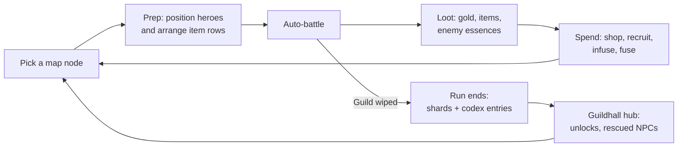

# Roguelite Game Plan (Design Doc)

Working title: Riftwright (placeholder). Last synced from the Claude Docs version on 2026-09-25.

## High concept

**Working title: Riftwright.** A PvE roguelite auto-battler where you lead a small adventurers' guild into collapsing rifts. Each hero carries a row of gear that fires on cooldowns, and you infuse that gear with essences pulled from the monsters you kill.

The one-line pitch: *Guildrun's team-building, fought with Bazaar-style item boards, where hidden Gungeon-style synergies are the thing you chase.*

**Tone:** cozy meets grim. The Guildhall is warm and lived-in; the rifts are dark and dangerous. Coming home between runs should feel like relief.

**Design pillars**

1. **Decisions happen between fights.** Combat is watched, not played. All skill lives in drafting, positioning, and infusing.
2. **Every run finds something new.** Named synergies and essence fusions are discovered, recorded, and hunted on later runs.
3. **Gear grows with you.** Infusions level up through use, so an item picked in the first act can carry the last one.
4. **Readable chaos.** Lots of things fire at once, but a player can always tell why they won or lost.

## What we take from each game

We borrow structure from Guildrun, the item board from The Bazaar, and the discovery feeling from Enter the Gungeon. Each borrowed idea gets changed so the result is its own game.

| Source | What we take | How we change it | What we leave behind |
| --- | --- | --- | --- |
| [Guildrun](https://store.steampowered.com/app/3669200/Guildrun/) | A guild of heroes with a reserve bench; bench heroes still give backup effects; ranks C→B→A→S with a specialization choice at B; hex positioning; Rush/Stall timing; a late-fight damage timer | Heroes fight with item rows instead of mostly stats and relics. Rank-ups also add item slots. | Its large relic pile (our relics sit on one shared team board with limited slots) |
| The Bazaar | Items of different sizes in a row, each firing on its own cooldown; adjacency effects; merchants and events between fights; enchantments | Enchantments are **harvested, fused, and leveled** instead of a fixed one per item (see Items and infusions) | Async PvP against other players' boards; the day/hour structure |
| Enter the Gungeon | Named item-pair synergies you discover; a hub that grows as you rescue NPCs; keys and locked chests; unlocking items into the run pool | Synergies extend to hero–item pairs and essence combos, and the game hints at them when both halves are for sale | Bullet-hell dodging, aiming, and all real-time input |

Sources for Guildrun details: [Steam page](https://store.steampowered.com/app/3669200/Guildrun/), [beginner's guide](https://games.gg/guildrun/guides/guildrun-beginners-guide/), [Rogueliker preview](https://rogueliker.com/guildrun-demo-steam-page/).

## Core loop

A run is about 45–60 minutes: three acts of roughly 10 nodes each, ending in a boss. Between fights you shop, recruit, and infuse; in fights you watch.

The inner loop (node to node) is where builds form. The outer loop (run to run) feeds unlocks and codex discoveries back into the pool.

## Guild, heroes, and combat

You field 3 heroes at the start and up to 5 by Act 3, with a roster cap of 6. The benched hero is never dead weight: each hero has a **Backup** effect that works from the bench, like Guildrun's.

**Heroes**

- Each hero has a class (Warden, Striker, Arcanist, Mender, Trickster, Ranger) and one signature passive.
- Ranks go C → B → A → S. At B you pick one of three specializations. Each rank-up also **adds one item slot**, so leveling a hero grows their board.
- A hero starts with 4 slots and ends at 7 at rank S.

**Item rows (the Bazaar part)**

- Every hero has their own row of slots. Items are Small (1 slot), Medium (2), or Large (3).
- Items fire on their own cooldown during the fight. A hero's auto-attack is just one more "item" in the row, so gear decides most of what a hero does.
- Adjacency matters inside a row: "the item to the left gets +20% crit" style effects.
- Items move freely between heroes at any time between fights, so reshuffling gear is part of every prep phase.
- The guild also shares one **relic board** (see Items and infusions).

**The arena (the Guildrun part)**

- A small hex grid. Heroes move and target on their own, but you set starting hexes.
- Some items care about position: *Linked* effects reach an adjacent ally's row, so two heroes standing together can share buffs.
- **Rush** items are strong for the first 8 seconds; **Stall** items wake up after 15 seconds. That gives fast and slow builds real identities.
- **Rift Collapse:** at 45 seconds the arena starts shrinking and dealing rising damage to both sides, so fights end by about 60 seconds.

**Readability tools** (required, not polish): a combat log, a per-item damage meter after each fight, 0.5×/1×/2×/4× speed, and pause.

## Items and infusions (our take on enchantments)

In The Bazaar an item gets one fixed enchantment. Here, enchantments are **Infusions**: essences you harvest from enemies, socket into gear, fuse into new types, and level up by using them.

**1. Harvest.** Each enemy family drops one of six base essences. The biome you route through decides which essences you can get, so map choices are also build choices.

| Essence | Dropped by | Effect when infused |
| --- | --- | --- |
| Ember | Fire elementals, cultists | Hits apply Burn |
| Frost | Wraiths, ice beasts | Hits Slow; 3 stacks Freeze for 1s |
| Storm | Harpies, constructs | Item cooldown −15%; chance to trigger twice |
| Stone | Golems, knights | Grants Shield equal to part of the item's damage |
| Verdant | Treants, fungi | Heals the lowest-HP ally |
| Umbral | Shades, assassins | +Crit; crits apply Bleed |

**2. Socket.** Small items have 1 socket; Medium and Large have 2. Infusing happens at a Forge node or from certain events.

**3. Fuse.** Two essences in one item's sockets fuse into an **Alloy** with its own effect, not just both effects added. Six essences give 15 cross-pairs plus 6 "pure" doubles, so 21 alloys in total. Examples:

| Alloy | Recipe | Effect |
| --- | --- | --- |
| Steam | Ember + Frost | Hits Blind enemies (their next attack misses) |
| Plasma | Ember + Storm | Burn jumps to a nearby enemy each tick |
| Glacier | Frost + Stone | Shield also Slows whoever breaks it |
| Bloom | Verdant + Storm | Heals trigger again on a random ally at 50% |
| Blight | Umbral + Verdant | Bleed damage heals your team |
| Inferno | Ember + Ember | Burn stacks never fall off |

**4. Attune.** Each infusion gains experience every time its item fires. At thresholds it becomes Attuned (stronger), then Resonant. A **Resonant** infusion spills a partial copy of its effect onto its neighbors (items in the row, or relics on the relic board). How it spills depends on what is socketed:

| Infusion | Spill to neighbors when Resonant |
| --- | --- |
| Single essence | Partial effect (about 30%) to **both** sides |
| Alloy (fused) | Split: one essence's partial effect to the left, the other's to the right. The alloy effect itself never spills |
| Pure double | Stronger partial effect (about 50%) to both sides |
| Essence transformation | **Never** spills |

This makes fusion a real trade-off: an alloy is the strongest effect on its own item, but singles and pure doubles do more for the items around them. Percentages are starting points for tuning.

**5. Transform.** Some specific item + essence and relic + essence pairs are **Essence Transformations**. Instead of adding an effect, the essence changes how the item or relic works. The drawback: a transformation never spills to its neighbors, even when Resonant.

- *Twin Daggers* + Frost: the daggers become thrown icicles that pierce through the first target.
- *Hourglass* (relic) + Storm: instead of slowing enemies at 20 seconds, it resets every ally's cooldowns once.
- *Iron Bulwark* + Ember: the shield no longer blocks damage; it explodes when broken, burning nearby enemies.

**Why this is different from The Bazaar:** enchantments come from what you fight, not a random roll; they combine; and an early item keeps getting better instead of being sold. The trade-off is commitment: removing an infusion at a Forge costs gold and resets its level.

**Other item rules**

- Rarity: Common, Uncommon, Rare, Legendary. Tags on every item (Weapon, Tome, Charm, Tool, Food) drive synergies and hero bonuses.
- Three identical items combine into a higher-rarity version, keeping the best infusion.

**Relic board (shared by the whole guild)**

- One team-wide board, separate from the hero rows. It starts with 3 slots and grows to 6 through boss kills and some events.
- Relics are team-wide passives or triggers, such as "the first ally to drop below 30% HP gains a Shield." They have sizes and adjacency like items do.
- Each relic has 1 socket and can be infused. A Resonant relic infusion spills to neighboring relics, never to hero items.
- Relics come from elites, bosses, Vaults, and events, about 2–3 per act.

## Synergies

Synergies work in five layers, from specific and secret (Gungeon-style) to broad and visible (auto-battler traits). The first three are discovered; the last two are always shown.

| Layer | Trigger | Example | Visibility |
| --- | --- | --- | --- |
| Named pairs | Two specific items on the **same hero** | *Whetstone* + *Twin Daggers* = **"Paper Cuts"**: each dagger hit reduces the other's cooldown by 0.2s | Hidden until found, then saved in the Codex |
| Essence transformations | A specific item or relic + a specific essence | *Twin Daggers* + Frost: daggers become piercing icicles. Never spills to neighbors | Hidden until found, then saved in the Codex |
| Signature gear | A specific item on a specific hero | Mender *Sister Vell* + *Old Lantern*: lantern heals also cleanse | Hinted in the hero's profile as "???" |
| Essence resonance | 3 / 5 / 7 items and relics team-wide sharing an essence (alloys count for both halves) | 5 Frost: frozen enemies take +30% damage | Always shown, like trait counters |
| Class traits | 2 or more heroes of a class fielded | 2 Wardens: front-row heroes get +15% Shield | Always shown |

**How discovery works**

- A synergy lights up with a glow and a name banner the first time it triggers, like Gungeon's arrow icon.
- When both halves of a known synergy are available (one in your row, one in the shop), the shop item gets a small spark icon.
- When both halves of an **undiscovered** synergy are available, it gets a "?" spark. The player knows *something* is there, but not what.
- The Codex tracks found / total per category, which gives completionists a long-term goal.

**Targets for launch:** about 80 named pairs, about 30 essence transformations, 1–2 signature items per hero, 6 essence resonances, 6 class traits.

## Run structure, map, and economy

Each act is a branching map of about 10 nodes, like a Gungeon floor laid out as a Slay the Spire-style path. Act 1 ends in a challenge fight, Act 3 in the final boss, then optional Endless mode.

| Node | What happens | Rough frequency per act |
| --- | --- | --- |
| Fight | Standard encounter; drops gold and 1–2 essences | 4–5 |
| Elite | Harder fight; guaranteed Rare item or rank-up | 1–2 |
| Merchant | Buy/sell items; reroll for gold | 1–2 |
| Forge | Infuse, fuse, or remove infusions | 1 |
| Tavern | Recruit a hero (pick 1 of 3) or rank one up | 1 |
| Vault | Spend a key on a locked chest (Gungeon-style) | 0–1 |
| Event | A choice with trade-offs, sometimes a rescued NPC | 1–2 |
| Boss | Act boss with a unique mechanic | 1 |

**Currencies in a run**

- **Gold:** shops, rerolls, removing infusions.
- **Essences:** stored in a pouch (cap of 8) until socketed, so you can't hoard every one.
- **Keys:** rare; open Vault chests and some shortcut paths.

**Biomes** each favor two essences (for example, the Ashen Mines drop Ember and Stone). A player chasing a Frost build will route toward frozen biomes, which gives map choices real weight.

## Meta progression

Meta progression adds **variety, not raw power**. A new player and a veteran with the same run pick-ups have the same stats.

- **The Guildhall** is the hub (like Gungeon's Breach). NPCs rescued during events move in and open new stations: a Forgemaster, a Cartographer, a Recruiter.
- **Rift Shards** are earned every run, win or lose. Spend them to unlock new items, heroes, and alloys into the run pool.
- **The Codex** records found synergies, alloys, and enemies. Finding a synergy the first time also gives bonus shards.
- **Difficulty tiers** (8 levels, each stacking a new modifier) unlock by beating the previous one, following Guildrun's model.
- **Hero mastery:** winning with a hero unlocks cosmetic skins and their second signature item. No stat boosts.

## Scope and roadmap

Build the combat sim and infusion system first, since they are the riskiest and most original parts. Content comes after the core is fun with placeholder art.

| Phase | Goal | Content | Done when |
| --- | --- | --- | --- |
| 1. Paper prototype | Test infusion and fusion math | Spreadsheet of 20 items, 6 essences | Alloys feel worth fusing |
| 2. Combat sim | Deterministic auto-battle, no art | 4 heroes, 20 items, 3 enemies | A fight can be explained from its log |
| 3. Vertical slice | One full act, playable start to boss | 8 heroes, 60 items, 6 essences, 10 alloys, 20 synergies | Playtesters want a second run |
| 4. Meta layer | Guildhall, shards, codex | Hub + 3 NPCs | Unlocks change how runs play |
| 5. Content build | Three acts plus Endless | 20 heroes, ~180 items, 21 alloys, ~80 synergies | Balanced across 3 difficulty tiers |
| 6. Demo / Early Access | Public feedback | Act 1 + 2 | — |

**Technical notes**

- Keep the combat simulation deterministic (seeded RNG, fixed timestep). That makes replays, bug reports, and balance testing much easier.
- Define items, essences, and synergies as data (JSON or engine assets), not code, with a small effect/trigger scripting layer.
- Write a headless sim runner that plays thousands of fights overnight to flag broken synergies and dead items.
- Engine: Godot or Unity both fit a 2D hex auto-battler. Godot is lighter for a solo project.

## Risks and decisions

The biggest risk is that combat becomes unreadable: five heroes each firing 5–7 items is 30+ effects at once.

| Risk | Mitigation |
| --- | --- |
| Fights are hard to read | Post-fight damage meter, combat log, slow-mo, and a cap of 7 slots per hero |
| Too many combinations to balance | Headless sim runner; ship fewer alloys (10) first and add more later |
| Feels like a mash-up of its sources | Lean hardest on the infusion system; it's the part none of the three games has |
| Fusion feels mandatory | Singles and pure doubles spill more to neighbors than alloys do (alloys split one essence per side); essence transformations give single essences a unique payoff, at the cost of never spilling |
| Scope creep | Hold the vertical slice to one act until playtesters ask for a second run |

**Decisions made**

- Items are per hero, plus one relic board shared by the whole team.
- Items move freely between heroes between fights.
- PvE only at launch.
- Art direction mixes cozy and grim.
- The name will be decided later (Riftwright is a placeholder).
