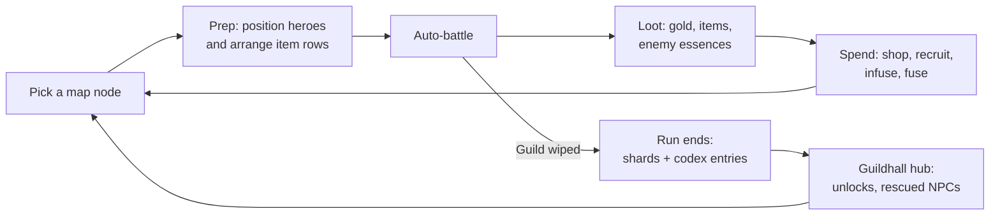

# Roguelite Game Plan (Design Doc)

Working title: Riftrite (placeholder). Synced from the Claude Docs version on 2026-09-25, then updated in the repo the same day with answers to the first round of design questions (see Decisions made). The Claude Docs version does not have those updates yet.

## High concept

**Working title: Riftrite.** A PvE roguelite auto-battler where you lead a small adventurers' guild into collapsing rifts. Each hero carries a row of gear that fires on cooldowns, and you infuse that gear with essences pulled from the monsters you kill.

The one-line pitch: *Guildrun's team-building, fought with Bazaar-style item boards, where hidden Gungeon-style synergies are the thing you chase.*

**Tone:** cozy meets grim. The Guildhall is warm and lived-in; the rifts are dark and dangerous. Coming home between runs should feel like relief.

**Design pillars**

1. **Decisions happen between fights.** Combat is watched, not played. All skill lives in drafting, positioning, and infusing.
2. **Every run finds something new.** Named synergies and essence fusions are discovered, recorded, and hunted on later runs.
3. **Gear grows with you.** Infusions level up through use, so an item picked in the first act can carry the last one.
4. **Readable chaos.** Lots of things fire at once, but a player can always tell why they won or lost.

## What we take from each game

We borrow structure from Guildrun, the item board from The Bazaar, and the discovery feeling from Enter the Gungeon. Each borrowed idea gets changed so the result is its own game.

| Source | What we take | How we change it | What we leave behind |
| --- | --- | --- | --- |
| [Guildrun](https://store.steampowered.com/app/3669200/Guildrun/) | A guild of heroes with a reserve bench; bench heroes still give backup effects; ranks C→B→A→S with a specialization choice at B; hex positioning; Rush/Stall timing; a late-fight damage timer | Heroes fight with item rows instead of mostly stats and relics. Rank-ups also add item slots. | Its large relic pile (our relics sit on one shared team board with limited slots) |
| The Bazaar | Items of different sizes in a row, each firing on its own cooldown; adjacency effects; merchants and events between fights; enchantments | Enchantments are **harvested, fused, and leveled** instead of a fixed one per item (see Items and infusions) | Async PvP against other players' boards; the day/hour structure |
| Enter the Gungeon | Named item-pair synergies you discover; a hub that grows as you rescue NPCs; keys and locked chests; unlocking items into the run pool | Synergies extend to hero–item pairs and essence combos, and the game hints at them when both halves are for sale | Bullet-hell dodging, aiming, and all real-time input |

Sources for Guildrun details: [Steam page](https://store.steampowered.com/app/3669200/Guildrun/), [beginner's guide](https://games.gg/guildrun/guides/guildrun-beginners-guide/), [Rogueliker preview](https://rogueliker.com/guildrun-demo-steam-page/).

## Core loop

A run is about 45–60 minutes: three acts of roughly 10 nodes each, ending in a boss. Between fights you shop, recruit, and infuse; in fights you watch.

The inner loop (node to node) is where builds form. The outer loop (run to run) feeds unlocks and codex discoveries back into the pool.

## Guild, heroes, and combat

You field 3 heroes at the start and up to 5 by Act 3, with a roster cap of 6. The benched hero is never dead weight: each hero has a **Backup** effect that works from the bench, like Guildrun's.

**Backup is a choice.** The player decides who fights and who sits in backup (at most 5 fielded, so with 6 heroes at least one is always in backup). A backup hero's Backup effect applies, and so do the backup modes of the items in their row, which allows builds like 3 fielded + 3 backup. Full rules: `docs/tiers-backup-specialization.md`.

**Heroes**

- Each hero has a class (Warden, Striker, Arcanist, Mender, Trickster, Ranger) and one signature passive.
- Ranks go C → B → A → S. At B you pick one of three specializations. Each rank-up also **adds one item slot**, so leveling a hero grows their board.
- A C-rank hero has 4 slots and an S-rank hero has 7.
- Heroes don't have to start at C. The Tavern can offer higher-rank recruits, following the same run-progress rules as item tiers (see Item tiers). A recruit at B or above comes with a **preset specialization**; changing it means **retraining** the hero.

**Item rows (the Bazaar part)**

- Every hero has their own row of slots. Items are Small (1 slot), Medium (2), or Large (3).
- Items fire on their own cooldown during the fight, so gear decides most of what a hero does.
- **Auto-attacks:** every hero has a **basic auto-attack** built in. **Auto-attack items** are items that replace it. They take up slots like any other item and can be Small, Medium, or Large. A hero can equip **only one** auto-attack item at a time. Take it out and the hero falls back to their basic auto-attack.
- Each hero's **basic auto-attack is their own** (a Ranger's differs from a Warden's). It **can't be upgraded**: it has no sockets and no tiers.
- Slot space is a real trade-off. Bigger items are stronger than smaller ones, so a Large item that fills most of a 4-slot hero's row is a valid build. A player can even drop the auto-attack item for another item and rely on the basic auto-attack. Synergies are what make a row of small items worth it instead.
- Adjacency matters inside a row: "the item to the left gets +20% crit" style effects.
- Items move freely between heroes at any time between fights, so reshuffling gear is part of every prep phase.
- The guild also shares one **relic board** (see Items and infusions).

**The arena (the Guildrun part)**

> **Prototype formation:** the first combat sim uses fixed **front and back rows** on each side instead of a hex grid. Each row is ordered left to right, and "adjacent ally" (for Linked effects) means the neighbor in the same row. The hex arena below is the target design and gets added once the item math feels good.

- A small hex grid. Heroes move and target on their own, but you set starting hexes.
- Some items care about position: *Linked* effects reach an adjacent ally's row, so two heroes standing together can share buffs.
- **Rush** items are strong for the first 8 seconds; **Stall** items wake up after 15 seconds. That gives fast and slow builds real identities. **What "strong" or "asleep" means is per item** (decided): a Rush item might deal 2x damage, hit every enemy, boost its neighbors, or double its holder's defense for 8 seconds; a Stall item might do nothing, or something weaker, before 15 seconds. Rush and Stall are labels (for the shop and synergies); each item's data says what actually changes.
- **Rift Collapse:** at 45 seconds the rift starts dealing damage to every unit on both sides every second, and the damage keeps growing. Early fights end around 60 seconds; strong mid- and late-game teams can last much longer.
  - It's a **flat amount, not a percentage of max HP**, so high-HP builds get to use their HP.
  - It hits **Shield before HP**, like any damage. Shield is effectively extra HP that healing can't restore, so a perfect shielding setup can stall out a fight on purpose.
  - **Ramp:** from 45s the damage grows by a fixed amount each second. From **90s it scales much harder**: the amount it grows by also increases every second.
  - **Per act:** Act 2 doubles the Act 1 numbers (10 → 20). Act 3 is still to be decided.
  - There's no separate time limit. If both sides survive to **3 minutes**, or both sides die on the same tick, the fight is a **tie, and a tie counts as a victory**. (In the hex arena the arena also shrinks.)

**Enemies**

- Enemies are hand-made units with **fixed item layouts**. They use the same item rows as heroes, but a designer sets each layout; enemies don't draft. That keeps fights readable and balanceable while enemies still play by the same rules as the guild.
- Some items are **enemy-only**, especially on bosses, which gives bosses their unique mechanics.
- Some enemy teams also carry **relics**, including **enemy-only relics**.
- Enemy items have **set tiers**, so you know what tier a given enemy's gear is.
- **Every fight guarantees one drop** (for now), picked from the enemy team's items and relics. Enemy-only items and relics can drop too, which is how players get a boss's gear. A dropped item keeps the tier the enemy had it at.

**Readability tools** (required, not polish): a combat log, a per-item damage meter after each fight, 0.5×/1×/2×/4× speed, and pause.

## Items and infusions (our take on enchantments)

In The Bazaar an item gets one fixed enchantment. Here, enchantments are **Infusions**: essences you harvest from enemies, socket into gear, fuse into new types, and level up by using them.

**1. Harvest.** Each enemy family drops one of six base essences. The biome you route through decides which essences you can get, so map choices are also build choices.

| Essence | Dropped by | Effect when infused |
| --- | --- | --- |
| Ember | Fire elementals, cultists | Adds Burn, sized from the item's output |
| Venom | Spiders, serpents, bog things (proposed) | Adds Poison, sized from the item's output |
| Wrath | Berserkers, war-beasts (proposed) | Adds attack damage, sized from the item's output |
| Stone | Golems, knights | Adds Shield, sized from the item's output |
| Verdant | Treants, fungi | Adds healing, sized from the item's output |
| Frost | Wraiths, ice beasts | Hits Slow one random item of the target, and its auto-attack |
| Storm | Harpies, constructs | Item cooldown −15%; chance to trigger twice |
| Umbral | Shades, assassins | +Crit; crits apply Bleed |

"Sized from the item's output" follows one conversion rule (same kind +50%; same family 50%; direct → over time 5%; over time → direct 500%). Details: `docs/plans/essence-rework.md`.

**2. Socket.** Small items have 1 socket; Medium and Large have 2. Infusing happens at a Forge node or from certain events.

**3. Fuse.** Two essences in one item's sockets fuse into an **Alloy** with its own effect, not just both effects added. Six essences give 15 cross-pairs plus 6 "pure" doubles, so 21 alloys in total. Examples:

| Alloy | Recipe | Effect |
| --- | --- | --- |
| Steam | Ember + Frost | Hits Blind enemies (their next attack misses) *(not built yet)* |
| Plasma | Ember + Storm | The item's Burn lands as **Plasma**, which jumps to the nearest other enemy after each tick |
| Glacier | Frost + Stone | Shield also Slows whoever breaks it *(not built yet)* |
| Bloom | Verdant + Storm | Every heal from the item echoes 50% onto a random other ally |
| Blight | Umbral + Verdant | The item's Bleed lands as **Blight**, whose damage heals your team (split evenly) |
| Inferno | Ember + Ember | The item's Burn lands as **Golden Flame** (placeholder name): same amount, never fades, heals strip it only 75% as well |

**How alloys work:** an alloy keeps both essences' normal effects and adds its special on top. A special that changes how a status behaves uses **its own status type** (Golden Flame, Plasma, Blight), so it never changes other items' or heroes' plain Burn or Bleed. Two essences with no named alloy yet still work, with both essences' effects and no special.

**Pure doubles** (two of the same essence) are alloys too, each with its own effect, and what that effect is depends on the essence. Most pure doubles add a bonus effect like Inferno's. **Doubled spill** is an optional idea: a pure double whose effect is doubled spill instead of a bonus effect. Maybe no pure double gets it. The first one to try is **Overgrowth (Verdant + Verdant)**, since spreading growth fits the idea, and the sim will show whether it earns its place. A pure double's bonus effect never makes its spill stronger. See the spill table below.

**4. Attune.** Each infusion gains experience (XP) and levels up at thresholds: base → Attuned (stronger) → Resonant.

- **XP comes from two sources:** each time the item fires, and each battle the item takes part in.
- **XP per fire is set per item**, based on its type and size. Items that fire often (like auto-attacks, which don't have the same kind of cooldown as other items) earn less per fire, so they don't level faster just by firing more.
- **XP resets** when a second essence is added to an item (turning a single into an alloy or pure double), and when an infusion is removed at a Forge.

A **Resonant** infusion spills a partial copy of its effect onto its neighbors (items in the row, or relics on the relic board). How it spills depends on what is socketed:

| Infusion | Spill to neighbors when Resonant |
| --- | --- |
| Single essence | Partial effect (about 30%) to **both** sides |
| Alloy (fused) | Split: one essence's partial effect to the left, the other's to the right, each at the same strength as a single essence's spill (about 30%) for now. For example, Steam (Ember + Frost) spills Ember only to its left neighbor and Frost only to its right. The alloy effect itself never spills |
| Pure double | The base essence's partial effect (about 30%, same as a single) to **both** sides. Its bonus effect never spills and never makes the spill stronger. Exception: a pure double whose effect *is* doubled spill (an optional idea, first tried on Overgrowth) spills about 60% instead |
| Essence transformation | **Never** spills |

The trade-off: an alloy is the strongest effect on its own item, but its spill is split, so each neighbor only gets one essence. Singles and pure doubles give both neighbors the same essence, which matters when stacking one essence across a row. Percentages are starting points for tuning, and the alloy spill strength may change after testing.

**5. Transform.** Some specific item + essence and relic + essence pairs are **Essence Transformations**. Instead of adding an effect, the essence changes how the item or relic works. The drawback: a transformation never spills to its neighbors, even when Resonant.

- *Twin Daggers* + Frost: the daggers become thrown icicles that pierce through the first target.
- *Hourglass* (relic) + Storm: instead of slowing enemies at 20 seconds, it resets every ally's cooldowns once.
- *Iron Bulwark* + Ember: the shield no longer blocks damage; it explodes when broken, burning nearby enemies.

**Why this is different from The Bazaar:** enchantments come from what you fight, not a random roll; they combine; and an early item keeps getting better instead of being sold. The trade-off is commitment: **reforging** (removing an infusion) at a Forge costs gold and resets its level.

**Other item rules**

- Rarity: **Common, Uncommon, Rare, Epic, Legendary** (Epic sits between Rare and Legendary). Rarity decides how often an item shows up, and also how complex it is, whether it has a backup mode, and how tailored its Oathbinding is. It is **separate from tier** (see Item tiers below): an item of any rarity can show up at any tier the run allows, and can be tiered up.
- **Size doesn't affect rarity.** Any Small item shows up exactly as often as any Large item of the same rarity. The game has more Small items than Medium, and more Medium than Large, so Small items turn up more overall simply because there are more of them.
- Every item has its own **crit chance, starting at 0%**. Umbral and some items raise it. A crit deals 150% damage (a tuning value).
- Items carry **multiple tags**: item tags (Weapon, Tome, Charm, Tool, Food) and class-fit tags (Melee, Ranged, Magic, Healing, Defense). Tags drive synergies, Oathbinding fit, and (later) boosts from other items and heroes.

**Item tiers (combining duplicates)**

Items use the **same tiers as hero ranks: C → B → A → S**. Items don't have to start at C; one can be found at any tier the run allows. An item moves up a tier by combining with a second copy of itself, instead of a Tavern visit.

- **Two copies of the same item at the same tier combine** into one item of the next tier. (Only two copies, not three.)
- You **can** hold two copies of the same item at *different* tiers; only same-tier copies combine. Duplicates are meant to be uncommon, so an upgrade you chased across a run feels earned.
- **Where higher tiers come from:** normal shops (and the Tavern, for heroes) unlock higher tiers as the run goes on. The first shop never offers A or S, and probably nothing above B shows up in all of Act 1. The exact schedule is a tuning table in `data/`. Before then, higher tiers only come from:
  - **Events** that open a tier-specific shop (say, an A-tier-only shop in Act 1) or hand out a single high-tier item.
  - **Enemy drops**, at that enemy's set tier.
  - **Loot drops** (Vault chests and the like), where the tier is random.
- **What happens to infusions when copies combine:**
  - If the new copy has no infusion, the upgraded item keeps yours, along with its XP.
  - If the new copy has its own essence or alloy, **the new infusion replaces yours**, and your infusion's XP is lost. So you choose: take the tier upgrade with the new infusion, or keep your item as it is and pass on the copy.
- Tier and rarity are separate. **S is the top tier**: an S item is maxed out and can't combine further.
- **Legendaries never combine.** Each has its own upgrade path (grows by use, essence-hungry, boss-forged, and so on), and a Legendary can appear only once per run.
- Shop tier odds by act (C/B/A/S, starting values): Act 1 80/20/0/0, Act 2 45/40/15/0, Act 3 20/40/30/10. The same table applies to Tavern heroes, so it lives in one data file.

**Oathbinding (hero–item):** when a hero and an item are both S tier, the player can permanently oathbind the hero to that item. One per hero; the item can't be removed, moved, or sold after that (but can be repositioned in the row and still infused); it leaves with the hero if the hero is dismissed; and a preview is shown before confirming. How specific the result is depends on rarity (Common: basic and generic, plus a basic backup ability; Legendary: unique). Full rules, the class-fit table, and Legendary upgrade paths: `docs/tiers-backup-specialization.md`.

**Relic board (shared by the whole guild)**

- One team-wide board, separate from the hero rows. It starts with 3 slots and grows to 6 through boss kills and some events.
- Relics are team-wide passives or triggers, such as "the first ally to drop below 30% HP gains a Shield." They have sizes and adjacency like items do.
- Each relic has 1 socket and can be infused. A Resonant relic infusion spills to neighboring relics, never to hero items.
- Relics come from elites, bosses, Vaults, and events, about 2–3 per act, plus drops from enemy teams that carry relics (including enemy-only relics).

## Synergies

Synergies work in five layers, from specific and secret (Gungeon-style) to broad and visible (auto-battler traits). The first three are discovered; the last two are always shown.

| Layer | Trigger | Example | Visibility |
| --- | --- | --- | --- |
| Named pairs | Two specific items on the **same hero** | *Whetstone* + *Twin Daggers* = **"Paper Cuts"**: each dagger hit reduces the other's cooldown by 0.2s | Hidden until found, then saved in the Codex |
| Essence transformations | A specific item or relic + a specific essence | *Twin Daggers* + Frost: daggers become piercing icicles. Never spills to neighbors | Hidden until found, then saved in the Codex |
| Signature gear | A specific item on a specific hero | Mender *Sister Vell* + *Old Lantern*: lantern heals also cleanse | Hinted in the hero's profile as "???" |
| Essence resonance | 3 / 5 / 7 of one essence socketed team-wide, across items and relics. It counts essences, not items: a single counts 1, an alloy counts 1 for each half, a pure double counts 2 of its essence, and an essence transformation counts as whatever essence(s) are socketed | 5 Frost: frozen enemies take +30% damage | Always shown, like trait counters |
| Class traits | 2 or more heroes of a class fielded | 2 Wardens: front-row heroes get +15% Shield | Always shown |

**How discovery works**

- A synergy lights up with a glow and a name banner the first time it triggers, like Gungeon's arrow icon.
- When both halves of a known synergy are available (one in your row, one in the shop), the shop item gets a small spark icon.
- When both halves of an **undiscovered** synergy are available, it gets a "?" spark. The player knows *something* is there, but not what.
- The Codex tracks found / total per category, which gives completionists a long-term goal.

**Targets for launch:** about 80 named pairs, about 30 essence transformations, 1–2 signature items per hero, 6 essence resonances, 6 class traits.

## Run structure, map, and economy

Each act is a branching map of about 10 nodes, like a Gungeon floor laid out as a Slay the Spire-style path. Act 1 ends in a challenge fight, Act 3 in the final boss, then optional Endless mode.

| Node | What happens | Rough frequency per act |
| --- | --- | --- |
| Fight | Standard encounter; drops gold, 1–2 essences, and one guaranteed item or relic from the enemy team | 4–5 |
| Elite | Harder fight; guaranteed Rare item or rank-up | 1–2 |
| Merchant | Buy/sell items; reroll for gold | 1–2 |
| Forge | Infuse, fuse, or remove infusions | 1 |
| Tavern | Recruit a hero (pick 1 of 3) or rank one up | 1 |
| Vault | Spend a key on a locked chest (Gungeon-style) | 0–1 |
| Event | A choice with trade-offs, sometimes a rescued NPC | 1–2 |
| Boss | Act boss with a unique mechanic | 1 |

**Currencies in a run**

- **Gold:** shops, rerolls, removing infusions.
- **Essences:** stored in a pouch (cap of 8) until socketed, so you can't hoard every one.
- **Keys:** rare; open Vault chests and some shortcut paths.

**Biomes** each favor two essences (for example, the Ashen Mines drop Ember and Stone). A player chasing a Frost build will route toward frozen biomes, which gives map choices real weight.

## Meta progression

Meta progression adds **variety, not raw power**. A new player and a veteran with the same run pick-ups have the same stats.

- **The Guildhall** is the hub (like Gungeon's Breach). NPCs rescued during events move in and open new stations: a Forgemaster, a Cartographer, a Recruiter.
- **Rift Shards** are earned every run, win or lose. Spend them to unlock new items, heroes, and alloys into the run pool.
- **The Codex** records found synergies, alloys, and enemies. Finding a synergy the first time also gives bonus shards.
- **Difficulty tiers** (8 levels, each stacking a new modifier) unlock by beating the previous one, following Guildrun's model.
- **Hero mastery:** winning with a hero unlocks cosmetic skins and their second signature item. No stat boosts.

## Scope and roadmap

Build the combat sim and infusion system first, since they are the riskiest and most original parts. Content comes after the core is fun with placeholder art.

| Phase | Goal | Content | Done when |
| --- | --- | --- | --- |
| ~~1. Paper prototype~~ | **Skipped.** The Phase 2 headless sim tests infusion and fusion math directly | — | — |
| 2. Combat sim | Deterministic auto-battle on fixed front/back rows, no art. Includes essences, alloys, attunement, and spill | 4 heroes, 20 items, 6 essences, a few alloys, 3 enemies | A fight can be explained from its log, and alloys feel worth fusing |
| 3. Vertical slice | One full act, playable start to boss | 8 heroes, 60 items, 6 essences, 10 alloys, 20 synergies | Playtesters want a second run |
| 4. Meta layer | Guildhall, shards, codex | Hub + 3 NPCs | Unlocks change how runs play |
| 5. Content build | Three acts plus Endless | 20 heroes, ~180 items, 21 alloys, ~80 synergies | Balanced across 3 difficulty tiers |
| 6. Demo / Early Access | Public feedback | Act 1 + 2 | — |

**Technical notes**

- Keep the combat simulation deterministic (seeded RNG, fixed timestep). That makes replays, bug reports, and balance testing much easier.
- The sim uses whole-number math only: integer HP, damage, and shields; percentages in basis points (10000 = 100%); time counted in ticks at 20 per second. Decimal (floating-point) math can round differently across platforms and refactors, which would break "same seed, same fight."
- Define items, essences, and synergies as data (JSON or engine assets), not code, with a small effect/trigger scripting layer.
- Write a headless sim runner that plays thousands of fights overnight to flag broken synergies and dead items.
- Engine: **Godot 4 with GDScript** (decided). It is light for a solo project, its UI system suits a game that is mostly menus and drag-and-drop, and it runs headless for the balance sim. Exact Godot and GUT versions are pinned in `CLAUDE.md`.

## Risks and decisions

The biggest risk is that combat becomes unreadable: five heroes each firing 5–7 items is 30+ effects at once.

| Risk | Mitigation |
| --- | --- |
| Fights are hard to read | Post-fight damage meter, combat log, slow-mo, and a cap of 7 slots per hero |
| Too many combinations to balance | Headless sim runner; ship fewer alloys (10) first and add more later |
| Feels like a mash-up of its sources | Lean hardest on the infusion system; it's the part none of the three games has |
| Fusion feels mandatory | Alloys split their spill (one essence per side) while singles and pure doubles give both neighbors the same essence; fusing resets XP; Small items have only 1 socket; essence transformations give single essences a unique payoff, at the cost of never spilling. The headless sim will show whether this is enough, and alloy spill strength is the first thing to tune if it isn't |
| Scope creep | Hold the vertical slice to one act until playtesters ask for a second run |

**Decisions made**

- Items are per hero, plus one relic board shared by the whole team.
- Items move freely between heroes between fights.
- PvE only at launch.
- Art direction mixes cozy and grim.
- The working title is **Riftrite** (still a placeholder); the final name will be decided later.
- Engine: Godot 4 + GDScript. Sim math is integer-only, with time counted in ticks.
- The spreadsheet prototype is skipped; the headless combat sim tests the infusion math instead.
- The first combat sim uses fixed front/back rows; the hex arena comes later.
- Enemies have hand-made, fixed item layouts with set tiers, and some items are enemy-only (especially boss items). Some enemy teams carry relics, including enemy-only ones. Every fight guarantees one drop from the enemy team's items and relics, and enemy-only ones can drop.
- Tier and rarity are separate. Same-tier copies combine. Copies at different tiers can be held together. Tiers are C → B → A → S, the same as hero ranks. Items and heroes can be found above C. Normal shops and the Tavern unlock higher tiers as the run goes on (no A/S early); before then, higher tiers come from events (such as tier-specific shops), enemy drops (set tier), and loot drops (random tier).
- Item size doesn't affect rarity. Each item of a given rarity shows up equally often; there are just more Small items than Large ones.
- Every item has a crit chance, starting at 0%. Crits deal 150% damage.
- Rift Collapse deals flat damage that grows every second (never a percentage of HP) and hits Shield before HP. The ramp gets much steeper after 90s, and Act 2 doubles the numbers. There's no time limit; reaching 3 minutes, or both sides dying on the same tick, is a tie, and a tie counts as a victory. Surviving to 3 minutes is meant to be possible, especially for strong mid- and late-game teams.
- Combat sim targeting: attacks hit the enemy front row; the back row only once the front row is empty, unless an item says it reaches the back row. Units killed during a tick still fire what they had ready that tick (for now). Heroes have HP only for now.
- A hero recruited at B or above has a preset specialization; changing it requires an event that offers retraining.
- Heals and "lowest HP" targeting use the lowest HP **percentage**, not the lowest raw HP.
- Items have five rarities (Epic added) and four tiers (C/B/A/S). S items can't combine; Legendaries never combine and appear at most once per run.
- Backup is the player's choice; backup heroes' Backup effects and their items' backup modes apply.
- An S-tier hero can be permanently **oathbound** to an S-tier item (**Oathbinding**; see `docs/tiers-backup-specialization.md`). "Specialization" is reserved for the rank-B choice.
- **Reforging** means removing an item's infusion (at a Forge; costs gold and resets its XP).
- **Item numbers are base values.** Tier and hero stats add **percentage boosts** on top (so do other bonuses later). The game shows both the base and the boosted value. This also applies to heroes' basic auto-attacks (hero stats only, since they have no tier).
- **Fallen heroes always come back** after a fight, with no downside.
- Items carry **multiple tags**, from both the item tags (Weapon, Tome, Charm, Tool, Food) and the class-fit tags (Melee, Ranged, Magic, Healing, Defense). Later, items and heroes can boost based on other items' tags.
- **Backup in the combat sim** is added after Phase 2's build steps.
- **Eight essences:** Venom (poison) and Wrath (attack damage) join the six. Alloys grow to 36 (28 cross-pairs + 8 pure doubles); essence resonances to 8.
- **Essences scale from the item's output** by one conversion rule (see `docs/plans/essence-rework.md`). Added damage and damage over time go to the enemy the item hit; added shield and heal go to whoever the item shields or heals, otherwise its holder.
- **Burn** is strongest, fades fast, and is weaker against shields. **Poison** never fades and ignores shields. **Bleed** never fades, hits shields, and lowers the target's defense by its stacks.
- **Frost's Slow** lands on one random item of the target and also slows its auto-attack. It no longer turns into Freeze. Freeze and Stun come later, from items and heroes, not essences.
- **Percentage boosts multiply** (tier C ×1, B ×1.5, A ×2, S ×3 as placeholders).
- **Units have six stats:** HP, ATK, MGK, DEF, CRIT, ATSP. Item numbers are a small base plus multipliers on those stats; boosts multiply on top.
- **Hero ranks (and enemy tiers) boost stats by 25% per rank**, compounding (placeholder).
- Common, Uncommon, and Rare items scale only from HP/ATK/MGK/DEF; Epic and Legendary items may also scale from ATSP and CRIT.
- **Healing weakens damage over time:** a heal removes 10% of the target's Burn, Poison, and Bleed stacks; each further heal on the same unit within one second removes half as much as the previous one (10%, 5%, 2.5%, ...). Placeholders.
- **Slow caps at 50%** per item.
- **Infusion levels:** Attuned makes an infusion ×1.5 as strong, Resonant ×2 (placeholders).
- **Rush/Stall and adjacency are built from per-item building blocks:** effect windows (active only for part of the fight), auras (continuous boosts to items or units, optionally windowed), area targets (all enemies/allies), and Linked variants (one neighbor, left, right, both, or the whole row). Aura output and stat boosts multiply; crit chance and cooldown boosts add.
- **Backup in the sim** (built): backup heroes are off the field (untargetable, no collapse damage, don't count for victory). Their Backup effect and their items' backup modes act from the bench, using effects on a cooldown and/or all-ally auras, scaled from the backup hero's stats; infusions work and earn XP. Backup-only items do what their own data says when fielded (often nothing). Common items can't have a backup mode (until Oathbinding); Legendary items must. Details: `docs/plans/backup-in-sim.md`.
- **Alloys keep both essences' effects** plus their special. Specials that alter a status get their own status type (Inferno → Golden Flame, Plasma → Plasma, Blight → Blight) so they don't leak into other items' statuses. First alloys built: Inferno, Plasma, Blight, Bloom.
- Every hero has their own built-in basic auto-attack, which can't be upgraded. An auto-attack item (Small, Medium, or Large) replaces it and takes up slots, and a hero can equip only one. Take the item out and the hero uses the basic auto-attack again.
- Two copies of the same item combine into the next tier (two, not three). A new copy's infusion replaces the old one.
- Alloy spill per side equals a single essence's spill for now.
- Pure doubles each have their own effect. Their bonus effect never strengthens spill. Doubled spill as a pure double's effect is an optional idea, tried first on Overgrowth (Verdant + Verdant).
- Infusion XP comes from item fires (amount set per item, by type and size) plus battles fought. XP resets when an infusion becomes an alloy or pure double.
- Essence resonance counts essences: a single = 1, an alloy = 1 of each half, a pure double = 2, and a transformation counts its socketed essence(s).

**Open questions**

- **Doubled spill:** does any pure double keep it? Overgrowth (Verdant + Verdant) is the first one to test.
- **Act 3 collapse numbers:** to be decided later.
- **Tier schedule:** at what point in a run do normal shops and the Tavern start offering B, A, and S? (A tuning table; it can be set once the run structure is being built.)
- **Stats and essence rework (in progress):** decisions, placeholders, and the build order are in `docs/plans/essence-rework.md`. Damage essences on items that don't hit need real per-item designs later; for now they hit the enemy directly across.
- More open questions on tiers, backup, Oathbinding, and Legendaries are listed at the end of `docs/tiers-backup-specialization.md`.
